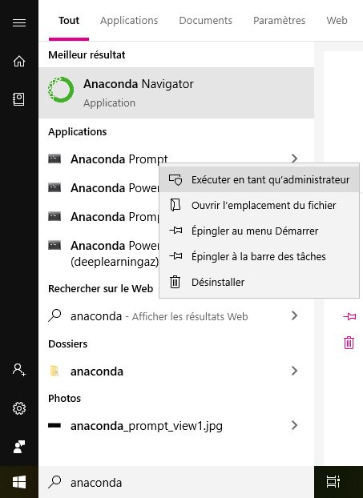

# deep_learning_tools
Informations concerning deep learning tools and software.

# ANACONDA

ANACONDA is a very useful tools for managing package software for deep learning.

Link to install anaconda : https://docs.anaconda.com/anaconda/install/

1. Windows : https://docs.anaconda.com/anaconda/install/windows/
2. Linux : https://docs.anaconda.com/anaconda/install/linux/

## Anaconda Navigator with terminal

The best way to update Anaconda is to use shell command to update or install package. Under Windows I have some problem when a want to install or upgrape package with the GUI mode.



Nota : under windows open the Anaconda prompt with the admin account.

List of some important command :

´´´
**anaconda-navigator** //for running the Anaconda GUI navigator

**conda update anaconda-navigator**  //for updating the anaconda GUI navigator

**conda upgrade conda** //upgrade conda

**conda upgrade --all** //upgrade alla package

**conda create -n [my-env-name]**  //create a new environment with conda with the current python

**conda create -n [my-env-name] python=[python-version]**  //create a new environment with conda with a special version of python
 
**source activate [my-env-name]** // activate your created environment
 
 

 **conda info**  //Explore the environment you created
 
 **conda list**  //Explore the environment you created


 **conda info -e**   //Explore your created environments
 
 **conda install -n [my-env-name] tensorflow** //install tensorfow with a specific environment
 
 **conda install -c anaconda tensorflow**       //install tensorflow in the active environment
  
 **conda install -c anaconda jupyter**       //install jupyther in the active environment for developping under python
 
 **jupyter** //for running jupyter developement environment
 
 **jupyter notebook** //for running jupyter notebook developement environment
 
 **spider** // for running python development environment
 

´´´


#DARKNET YOLO SOFTWARE
Informations concerning the YOLO V3 software. Whit this tool you can detect object or person using neurql network.

## Learn your own object

### Sofware compilation
Before starting using this software you can use these git command to uplaof software on your computer.
```
//original deposit of darknet
git clone https://github.com/pjreddie/darknet

//recent fork of the darknet by AlexeyAB
//I use this fork for testing detect ownn object
//Yolo-v4 and Yolo-v3/v2 for Windows and Linux
git clone https://github.com/AlexeyAB/darknet.git

For testing under jetson nano platform create the jetson branch
git checkout darknet_yolo_v3 -b jetson_nano

// for loading software using to mark your own object on picture for the learning
git clone https://github.com/AlexeyAB/Yolo_mark.git
```
**Under linux** use these commands :
#### Compilation under Linux with cmake
If you want to use cmake, after install cmake compilator, use these commands :
```
mkdir build-release
cd build-release
cmake ..
make
make install
```

####  Compilation under Linux with make
If you want run the make compilation, use these commands :
```
// run make in the darknet directory.
//before do this you can configure the Makefile for using GPU or other options.
make
```
Before make, you can set such options in the Makefile: link

 . GPU=1 to build with CUDA to accelerate by using GPU (CUDA should be in /usr/local/cuda)
 . CUDNN=1 to build with cuDNN v5-v7 to accelerate training by using GPU (cuDNN should be in /usr/local/cudnn)
 . CUDNN_HALF=1 to build for Tensor Cores (on Titan V / Tesla V100 / DGX-2 and later) speedup Detection 3x, Training 2x
 . OPENCV=1 to build with OpenCV 4.x/3.x/2.4.x - allows to detect on video files and video streams from network cameras or web-cams
 . DEBUG=1 to bould debug version of Yolo
 . OPENMP=1 to build with OpenMP support to accelerate Yolo by using multi-core CPU
 . LIBSO=1 to build a library darknet.so and binary runable file uselib that uses this library. Or you can try to run so LD_LIBRARY_PATH=./:$LD_LIBRARY_PATH ./uselib test.mp4 How to use this SO-library from your own code - you can look at C++ example: https://github.com/AlexeyAB/darknet/blob/master/src/yolo_console_dll.cpp or use in such a way: LD_LIBRARY_PATH=./:$LD_LIBRARY_PATH ./uselib data/coco.names cfg/yolov4.cfg yolov4.weights test.mp4
 . ZED_CAMERA=1 to build a library with ZED-3D-camera support (should be ZED SDK installed), then run LD_LIBRARY_PATH=./:$LD_LIBRARY_PATH ./uselib data/coco.names cfg/yolov4.cfg yolov4.weights zed_camera

To run Darknet on Linux use examples from this article, just use this command
```
./darknet instead of darknet.exe, i.e. use this command: ./darknet detector test ./cfg/coco.data ./cfg/yolov4.cfg ./yolov4.weights
```
