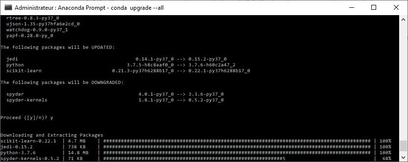

# deep_learning_tools
Informations concerning deep learning tools and software.

# ANACONDA

ANACONDA is a very useful tools for managing package software for deep learning.

Link to install anaconda : https://docs.anaconda.com/anaconda/install/

1. Windows : https://docs.anaconda.com/anaconda/install/windows/
2. Linux : https://docs.anaconda.com/anaconda/install/linux/

## Anaconda Navigator with terminal

The best way to update Anaconda is to use shell command to update or install package. Under Windows I have some problem when a want to install or upgrape package with the GUI mode.

Nota : under windows open the Anaconda prompt with the admin account.

List of some important command :

´´´
**anaconda-navigator** //for running the Anaconda GUI navigator

**conda update anaconda-navigator**  //for updating the anaconda GUI navigator

**conda upgrade conda** //upgrade conda

**conda upgrade --all** //upgrade alla package

**conda create -n [my-env-name]**  //create a new environment with conda with the current python

**conda create -n [my-env-name] python=[python-version]**  //create a new environment with conda with a special version of python
 
**source activate [my-env-name]** // activate your created environment
 
 

 **conda info**  //Explore the environment you created
 
 **conda list**  //Explore the environment you created

 **conda info -e**   //Explore your created environments
 
 **conda install -n [my-env-name] tensorflow** //install tensorfow with a specific environment
 
 **conda install -c anaconda tensorflow**       //install tensorflow in the active environment
  
 **conda install -c anaconda jupyter**       //install jupyther in the active environment for developping under python
 
 **jupyter** //for running jupyter developement environment
 
 **jupyter notebook** //for running jupyter notebook developement environment
 
 **spider** // for running python development environment
 

´´´

